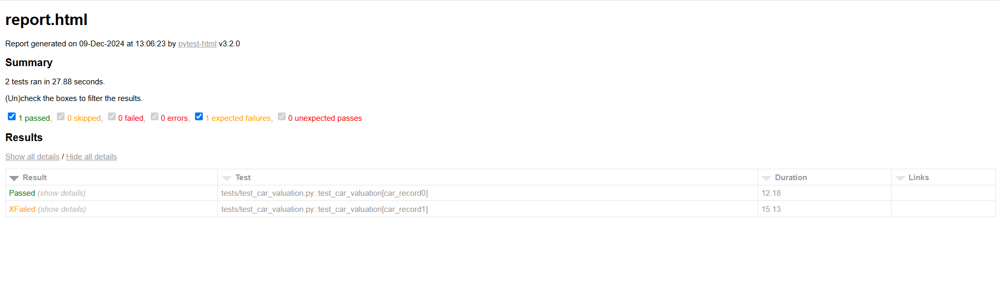

# Car Valuation Automation Suite

This project automates validation of car valuations using **Python** and **Playwright** with page object pattern for maintainability.
This project uses "Webuyanycar.com" web application to perform the valuation.
---

## Features
- Reads input from `car_input.txt`.
- Automates website interactions for valuation retrieval.
- Compares website output with `car_output.txt`.
- Logs mismatches or matches to the console.
---

## Project Structure
```plaintext
.

├── pages/                   # Reusable web interaction methods based on page
├── utils/                   # Utils or helpers methods
├── tests/                   # Test scripts
├── actions/                 # User Actions 
├── data/                    # Test data      
├── requirements.txt         # Dependencies
├── README.md                # Documentation
```

---

## Prerequisites
1. Install **Python 3.8+**.
2. Install dependencies:
   ```bash
   pip install pytest playwright pandas
   playwright install
   ```

---

## How to Use
1. Update `car_input.txt` with vehicle details:
   ```plaintext
   VARIANT_REG,MAKE,MODEL,YEAR
   RA04DWC,Ford,Fusion2,2004
   ```
2. Add expected valuations to `car_output.txt`:
   ```plaintext
   RA04DWC,£670
   ```
3. Run the test script:
   ```bash
   pytest
   ```

---

## Sample Output
```plaintext
Test passed for RA04DWC: Valuation matched.
Test failed for RA05XYZ: Mismatch for RA05XYZ: Expected £2400, Got £1,165
```

## HTML Test Report
```plaintext
HTML Reports are generated after execution with an option to capture screenshot/video/trace file on failure.
./html-report

Example Report:

```


Note: 
- Mismatches scenarios will be passed but logged in console as expected fails.
- No Sensitive data used in this project. If Sensitive data required then its required to use 3rd party credential manager.
- Setup and Teardown fixtures are stored in conftest.py

## Test Execution Demo
[DemoTestExecution.mp4](DemoTestExecution.mp4)
